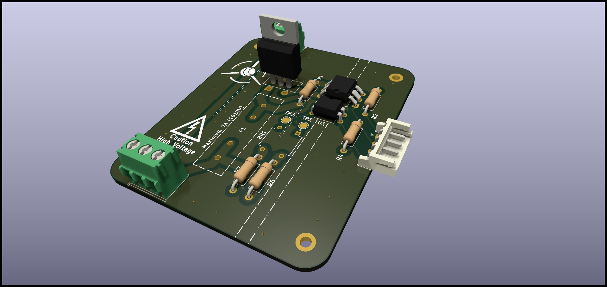

# ACDimmer

This is my first PCB design using mains. It's purpose is to lower the power delivered to heating resistors from a toaster oven in order to make my own reflow oven that will go with a future PnP machine project.

AC Dimmers already exist on the market, most of them doesn't work with mains and the others use a potentiometer to control the TRIAC. I obviously need a microcontroller to manage the TRIAC so the solder profile can be correctly followed.

Seeing that these are difficult to find, I decided to make my own.

## The Board

The board works as a passthrough for mains so I don't need to use lever wire connectors for the ground and neutral. For a DIY reflow oven, a toaster oven of 1500W is recommended, so the board is made to handle a maximum of 7A (around 1600W) (as such, it needs 2 oz/ft² of copper) limited by a fuse at the start of the circuit. The circuit is then splitted, one part goes for the two TRIACs (one of them is the optocoupler that controls the main TRIAC) and the other is for a zero crossing detector to synchronize the microcontroller with mains frequency.

I am well aware of the dangers of mains, so I made sure the clearances were correct, there is a clear separation from the high voltage and low voltage parts of the PCB (linked by optocouplers), the whole PCB is grounded and although the TRIAC datasheet recommends using capacitors (to absorb inrush currents that mostly appear at 50% power), they can be very dangerous and they are not really necessary as there are no sensible components in the circuit (which consist only of a few heating resistors in series). I also plan to 3D print a case with a fire retardant filament, we never know.

All components are THT so I can solder them by hand easily, I might make a V2.0 with SMD components later, I need this one first because I need a reflow oven to reflow the PCB with SMD components for the reflow oven... .

